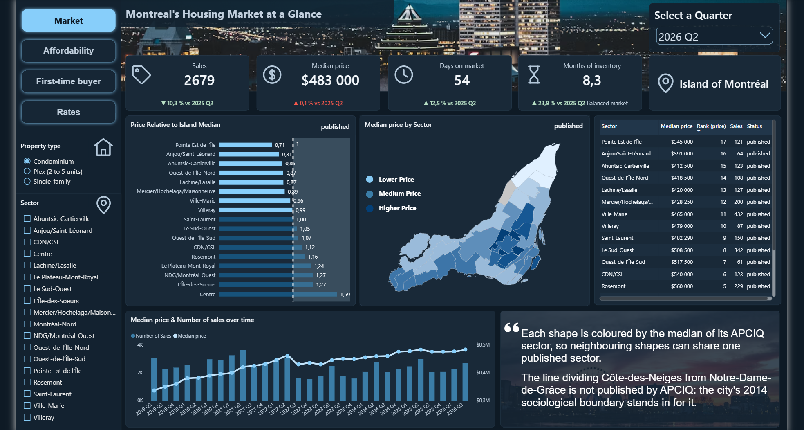
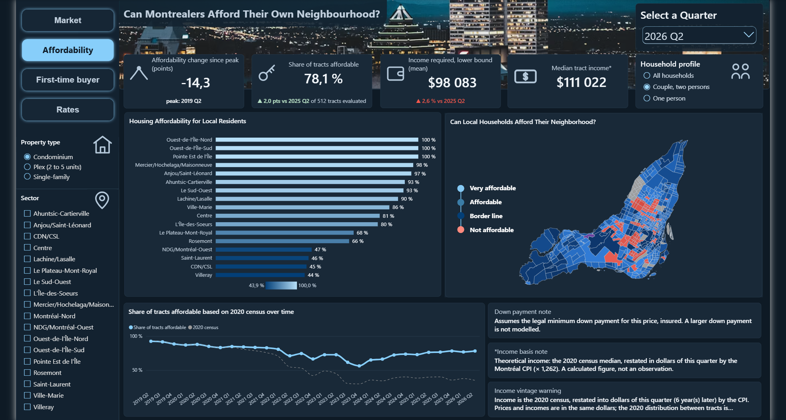
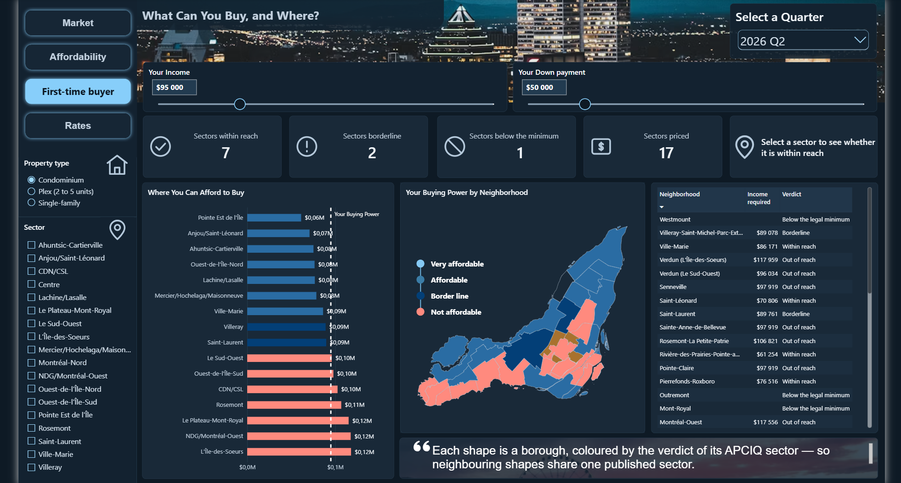
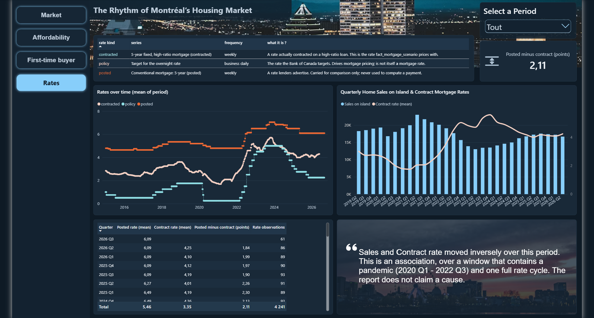
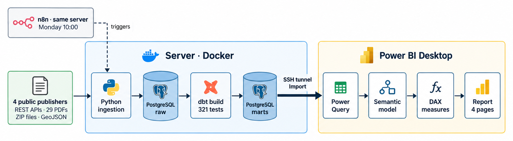
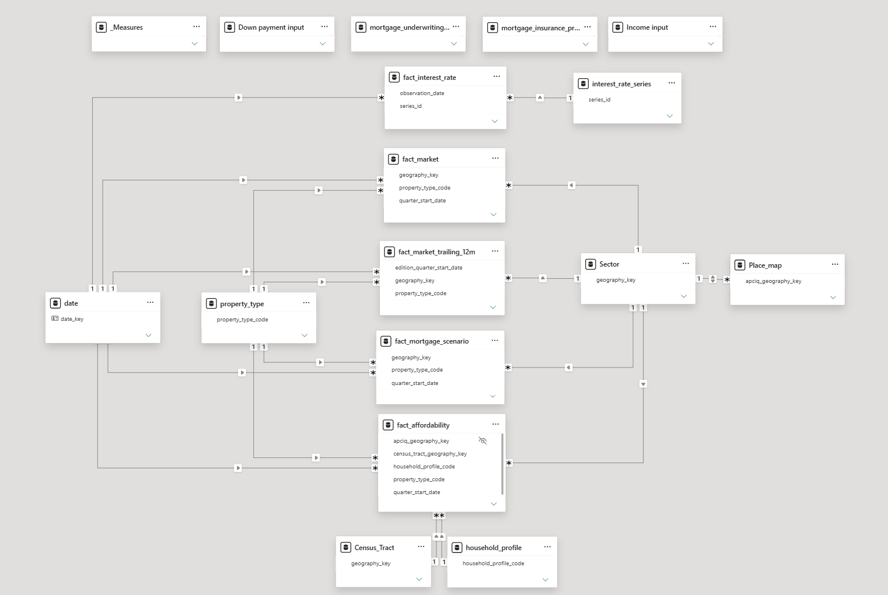
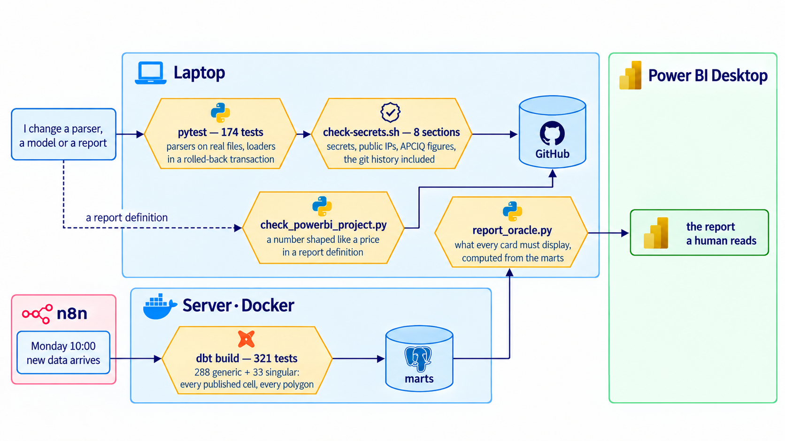
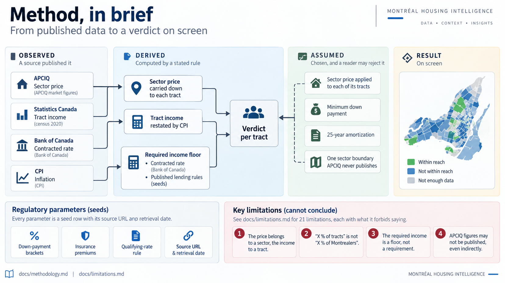
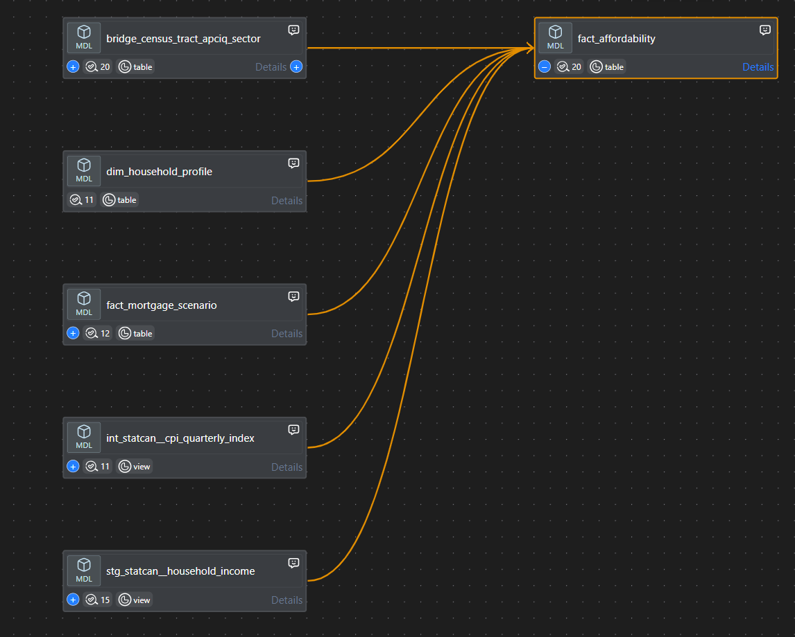

# Montreal Housing Intelligence

Analytics platform on the residential real-estate market of the **Island of
Montreal**: nine public datasets from four publishers, with incompatible grains, brought into one
PostgreSQL/PostGIS model, transformed and tested with dbt, scheduled with n8n,
and consumed in a four-page Power BI report.

The question it exists to answer is not "what does a condo cost in Montreal"
but **"where can a first-time buyer still buy, on what income, and how has that
changed?"**

> **Status: the MVP is built end to end and is in final acceptance.**
> 29 quarters of market data (2019 Q2 to 2026 Q2), 541 census tracts, three
> property types, three household profiles — ingested on a weekly schedule,
> rebuilt with 321 tests, and read by a report that is checked against the
> database figure by figure.

---

## At a glance

| | |
|---|---|
| Public sources | **4 publishers, 9 datasets** — Bank of Canada, APCIQ, Statistics Canada, Ville de Montréal |
| History | **29 quarters**, 2019 Q2 to 2026 Q2 |
| Geography | **541 census tracts** and **18 market sectors** covering the whole island |
| PDF reports read without human intervention | **29** |
| Largest table | **141 462 rows** |
| Tables | **31** in the database, **17** in the Power BI model |
| Relationships in the Power BI model | **17** one-to-many, **1** of them bidirectional |
| Automated tests | **495** — 321 dbt, 174 pytest |
| Refresh | **weekly and unattended**, about 3 minutes |
| Report | **4 pages**, **3 maps** |

---

## What it found

Every figure below is a **share, a count, a rate or a change**. None is a price.
That is a rule, not modesty: the market figures come from APCIQ, the repository's
text never distributes them, and a price-to-income ratio multiplied by a published
census income would give the price back. The rule and the check that enforces it
are in [`docs/limitations.md`](docs/limitations.md) section 4; what the dashboard
shows, and under which terms, is in [`docs/apciq.md`](docs/apciq.md) section 1.

All figures were measured against the live database on 2026-09-14.

### 1. On a median income, one person is shut out almost everywhere

Share of the island's census tracts where the **median household of that
profile** clears the lending test for **the median property of its sector**,
with the minimum down payment and no other capital — 2026 Q2:

| Property type | Tracts evaluated | Couple | All households | One person |
|---|---|---|---|---|
| Condominium | 512 | **78.1 %** | 31.8 % | **0.8 %** |
| Single-family | 395 | 4.3 % | 5.3 % | 0.0 % |
| Plex | 317 | 0.9 % | 0.3 % | 0.0 % |

In **99.2 % of census tracts**, a single person on their neighbourhood's median
income cannot buy their sector's median condominium.

Two things this table does **not** say. It is not "X % of Montrealers": it
compares two medians per tract, never a population. And it is **optimistic**:
the lending test counts property tax, heating and condo fees, and this model has
none of the three, so the real share is lower.

### 2. Three quarters of the apparent collapse is a frozen income

The only income published below the metropolitan level is the 2021 census, for
income year 2020. Read as is, the condominium share for a couple falls from
**93.2 % to 35.0 %** between 2019 Q2 and 2026 Q2. Restated into dollars of each
quarter by the Montréal CPI, it falls from **92.5 % to 78.1 %**.

The market did deteriorate — the 2022 Q2 break survives the restatement, at
**−9.6 points in a single quarter** — but most of the fall shown in 2020 dollars
is six years of inflation applied to prices and not to incomes. The report
displays the restated figure, calls it a **theoretical** median income on screen,
and keeps the 2020 reading one tooltip away.

### 3. The price-to-income ratio would have told the opposite story

| Condominium · couple | Qualifying rate | Median price-to-income | Tracts within reach |
|---|---|---|---|
| 2021 Q4 | 5.25 % | *(baseline)* | 82.8 % |
| 2023 Q4 | 7.59 % | **−4.5 %** | **56.3 %** |

The standard affordability ratio **improved** while a quarter of the island's
tracts dropped out of reach. A ratio is a division and contains no interest
rate. That is why the report's map colours the **income shortfall** in dollars,
which passes through the qualifying rate, rather than the ratio.

### 4. A sector average hides most of the answer

APCIQ publishes prices for 18 sectors; incomes vary within them. **58.4 % of the
variance in tract median income sits inside a sector**, not between sectors.
Consequence on 2026 Q2, condominium, couple: in **14 of the 17 sectors** with a
published price, some tracts are within reach and others are not — at one and
the same price. A model at sector grain would have issued one verdict per sector
and been wrong on a large part of each.

### 5. Which rate series you pick moves the answer by nearly two points

The Bank of Canada publishes a **posted** 5-year rate, the one banks advertise,
and a **contracted** 5-year rate for high-ratio mortgages — exactly the loan a
buyer with the minimum down payment takes. On 2026 Q2: **6.090 % against
4.247 %, a 1.84-point gap.** The model computes on the contracted rate and keeps
both on the same row.

That contracted series has published nothing since **2026-06-02** — 104 days on
2026-09-14, for a series whose largest gap in 596 observations was 7 days. The
pipeline is current on the other two series; the source has gone quiet, and the
limitation says so rather than guessing why.

### 6. What the sources turned out to be

- **APCIQ's quarterly figures are a vintage.** Its published 12-month total is
  smaller than the sum of its own four quarters, and at island level it is
  **never** larger — 0 windows out of 78. Summing four quarters does not
  reproduce APCIQ's annual figure, so the 12-month figures live in a separate
  table that no slicer can add up.
- **Four editions contradict themselves.** Three of them have active-listing
  counts that reconcile nowhere. They are loaded with their verdict attached
  rather than refused, because refusing them would destroy the only trace of
  the defect.
- **The island is census division 2466** — 16 subdivisions for 16
  municipalities. It is delimited by a published code, with no spatial join.
- **In the census income table, "not applicable" prints the digit `0`.** Read
  naïvely it produces 18 404 median incomes of 0 $ per measure on the
  Montréal CMA; only the symbol column separates them from genuine zeros.

---

## The report

Four pages in Power BI Desktop, reading the marts in Import mode. Each page was
accepted card by card against `scripts/report_oracle.py`, which recomputes from
the database what every visual must display — a visual can have the right shape
and the wrong number, and several of them did.

Screenshots taken on **2026-09-17**, all four on 2026 Q2, condominium. The
market figures on screen are **Source : APCIQ par le système Centris**, shown
here for a non-commercial project; this repository never redistributes them as
data, and no APCIQ figure appears in any of its text files.

### Market — what the market did



Sales, median price, days on market and months of inventory, each compared with
**the same quarter one year earlier**: a quarter-on-quarter badge would have
measured a season rather than the market on three of those four metrics. Months
of inventory uses APCIQ's own definition — inventory over the average sales of
the past 12 months — and APCIQ's own thresholds, not the North American
convention. The bar chart shows each sector's price **relative to the island
median**, so its axis does not move from one quarter to the next, and carries the
sector's rank because a re-sorted order shows position but hides movement. The
map draws 36 shapes cut to land; several of them share one published sector, and
the note on the page says so.

### Affordability — can the people living there buy there?



The share of the island's 541 census tracts where the median household of the
selected profile clears the lending test for the median property of its sector.
The income on screen is **theoretical**: the 2020 census median restated into the
dollars of the quarter by the Montréal CPI. It is a calculated figure, it carries
its own column, and the page says so permanently. The map colours each tract by
the **shortfall in dollars**, diverging at zero, rather than by a price-to-income
ratio — for the reason in finding 3 above: the ratio contains no interest rate.

### First-time buyer — what can you buy, and where?



Two what-if parameters, income and down payment, drive the whole page. The
mortgage chain is recomputed in DAX at the entered down payment — legal minimum,
insurance premium, qualifying rate, payment, required income — and reproduces the
mart to the cent on every priced row, with zero divergence. A down payment below
the legal minimum for that price is **refused**, never computed: testing legality
before looking up the premium band removes the branch instead of guarding it.

### Rates — the rhythm of the market



The three Bank of Canada series the project carries, and what each one is: the
policy rate, the rate lenders advertise, and the rate actually contracted on a
high-ratio loan — the one the model prices with. The gap between the last two is
a column to subtract, not a caveat to remember. The commentary says
**association**, over a window that contains a pandemic and one full rate cycle;
the report claims no cause.

---

## How it works



Data only flows one way: sources are read, never written to. **n8n is not part
of the data path** — it triggers the runner container, which reads the sources
with Python and then runs dbt, and dbt transforms the data *inside* PostgreSQL.
The database listens on the server loopback only and is never exposed to the
internet; Power BI reaches it through an SSH tunnel.

*Counts on the diagram — 4 publishers, 29 PDFs, 321 tests, 4 report pages — are
those of 2026-09-15. The test count is the one `dbt build` prints; the layer by
layer graph in [`docs/architecture.md`](docs/architecture.md) is regenerated
from the dbt manifest and never goes stale.*



*The Power BI semantic model: five fact tables in the centre, seven dimensions
around them, 17 one-to-many relationships, only one of them bidirectional
(`Place_map` ↔ `Sector`, so a map shape can filter the market facts). The
database's single geography table is split at import into `Sector` and
`Census_Tract`, because the market facts are keyed on a sector and the
affordability fact on a tract. The five tables along the top carry no
relationship on purpose: the DAX measures, the two what-if parameters, and the
two published lending-rule tables the down-payment measures look up.*

### Five gates, at five different moments



<sub>Diagram laid out with AI from the gate table in
[`docs/architecture.md`](docs/architecture.md) section 7, which also keeps the
same five gates as a mermaid source. Counts are those of 2026-09-17.</sub>

Nothing reaches GitHub or the report without passing a gate, and the two paths
are guarded differently because they fail differently: a change can leak a
secret, new data can be wrong while looking plausible.

**Every one of these gates has been fired on purpose** — a corrupted value, a
deleted polygon, a planted figure — because a test that has never failed has not
shown that it can. Twice, that exercise found a hole in the tests rather than in
the data. `bash scripts/prove-quality-gate.sh` replays the simplest one end to
end: corrupt a raw value, require `dbt test` to fail *and name the test*, repair
by re-running the pipeline, require the tests to pass again.

**[`docs/architecture.md`](docs/architecture.md)** is the full account: where
each piece runs, the contract at each hand-off, the marts, the five quality
gates and the security model.

### Stack

| Tool | What it does here |
|---|---|
| **Python 3.14** | four ingestion packages: a REST client, a CKAN client, a Statistics Canada Web Data Service client, and a positional parser for PDFs that contain no table objects |
| **PostgreSQL 17 + PostGIS 3.5** | the raw, staging and marts layers; polygons for 541 tracts, 18 sectors and 36 map places |
| **dbt Core** | 25 models, 7 seeds, 321 tests — 33 of them written for this data |
| **Docker Compose** | the database and a pipeline runner, from one file |
| **n8n** | the weekly schedule, a verdict carried by exit code, an alert on failure |
| **Power BI** | a four-page report with DAX what-if parameters for income and down payment |

---

## Method, in brief



<sub>Diagram laid out with AI from the text below. The map is illustrative, not a
measured result.</sub>

Every number is one of three things, and **a column says which** — because prose
does not reach a Power BI report:

- **Observed** — a source published it: APCIQ market figures, the 2020 census
  income, the Bank of Canada rates, the CPI.
- **Derived** — computed by a stated rule: the income restated by the CPI, the
  mortgage payment, the required income, the verdict.
- **Assumed** — chosen, and a reader may reject it: the sector price applied to
  each of its tracts, the minimum down payment, a 25-year amortization, and one
  sector boundary APCIQ never publishes.



*What dbt builds before a single tract can be called affordable: an APCIQ price
carried through `fact_mortgage_scenario`, a Statistics Canada household income,
the CPI index that restates that income in the dollars of the quarter, the
geographic bridge that ties a census tract to an APCIQ sector, and the household
profile. The figure on each model is how many dbt tests guard it — 20 on the
fact itself. Read from the dbt lineage panel on 2026-09-15 and checked against
the manifest; [`docs/architecture.md`](docs/architecture.md) carries the full
graph of all 22 models, regenerated from that manifest rather than drawn.*

The chain, from a published figure to a verdict on screen:

```
sector price (APCIQ) ── carried down to each tract ──┐
                                                     ├─► verdict per tract
tract income (census 2020) ── restated by CPI ───────┤
                                                     │
contracted rate (Bank of Canada) ─┐                  │
published lending rules (seeds) ──┴─► required income floor
```

Every regulatory parameter — down-payment brackets, insurance premiums, the
qualifying-rate rule — is a seed row carrying its source URL and retrieval date,
never a constant in SQL.

**[`docs/methodology.md`](docs/methodology.md)** walks the chain step by step.
**[`docs/limitations.md`](docs/limitations.md)** lists 21 limitations, each
with what it forbids saying. The four that block a conclusion outright:

1. The price belongs to a sector, the income to a tract.
2. "X % of tracts" is not "X % of Montrealers".
3. The required income is a **floor**, not a requirement.
4. APCIQ figures may not be published, even indirectly.

---

## Sources

| Source | Supplies | Grain | Redistribution |
|---|---|---|---|
| Bank of Canada — Valet API | policy rate, posted and contracted 5-year mortgage rates | Canada · daily and weekly | allowed with attribution |
| APCIQ — *Baromètre résidentiel* | sales, active listings, median price, days on market | 18 sectors + island · quarterly | **not allowed** |
| Statistics Canada — Census 2021, table 98100058 | median total income, by household size and type | census tract · income year 2020 | allowed |
| Statistics Canada — geographic attribute file, tract boundaries | codes, population, polygons | dissemination block · census tract | allowed |
| Statistics Canada — table 18100004 | Consumer Price Index, all items | Montréal CMA · monthly | allowed |
| Ville de Montréal — open data | administrative boundaries, two neighbourhood files | 34 entities · neighbourhood | allowed (CC BY 4.0) |

**[`docs/data-sources.md`](docs/data-sources.md)** is the full matrix: each
dataset tested against a real HTTP request with its status code and date, the
variables actually observed, and the licence quoted with its URL.

**Historical perimeter: 2019 Q2 onward**, not 2015 as first planned. The APCIQ
quarterly archive does not reach further back.

---

## Reproduce it

Nothing below needs anything from the author: no server access, no credentials,
no data file. Every source is public; the APCIQ PDFs are downloaded from APCIQ's
own site into a git-ignored folder and never redistributed.

> **Note.** The project itself runs the server layout described further down,
> and every command here has been run against that database. The fully local
> layout uses the same Compose file and the same bootstrap scripts, but has not
> been executed end to end on a workstation.

### What you need

* Docker
* Python 3.12 or later (built and tested on 3.14.6)
* Git Bash, or any POSIX shell. On Windows, the scripts are written for Git Bash.

### 1. Clone and configure

```bash
git clone <this repository>
cd montreal-housing-intelligence
cp .env.example .env
```

Open `.env` and set two things:

```
POSTGRES_PASSWORD=<a long random string>
MHI_DB_PORT=5432
```

Generate the password with:

```bash
python -c "import secrets; print(secrets.token_urlsafe(32))"
```

`MHI_DB_PORT=5432` says "the database runs on this machine". Leave it commented
out only if you are using the SSH tunnel layout described further down.

`.env` is git-ignored and must never be committed.

### 2. Start the database

```bash
docker compose up -d
docker compose ps
```

Wait for `healthy`. On first start, the ten numbered scripts in `sql/bootstrap/`
create the schemas, the raw tables and the PostGIS extension. On a database that
already runs, `bash scripts/migrate.sh` applies the same files and refuses any
that changed after being applied.

The port mapping is `127.0.0.1:5432`, not `5432`. The database is bound to the
loopback interface and is unreachable from outside the machine. That single
prefix is the security model; do not remove it.

### 3. Install the Python environment

```bash
bash scripts/setup-venv.sh
```

Creates `.venv` with the exact versions in `requirements.lock.txt`. The commands
below use the Windows path `.venv/Scripts/python.exe`; on Linux or macOS it is
`.venv/bin/python`.

### 4. Load the sources — then load them again

```bash
.venv/Scripts/python.exe -m ingestion.bank_of_canada.run
.venv/Scripts/python.exe -m ingestion.statcan.run
.venv/Scripts/python.exe -m ingestion.montreal_open_data.run
.venv/Scripts/python.exe -m ingestion.apciq.run
```

The APCIQ step is the long one: it downloads 29 PDFs, about 183 MB, and parses
each page. On the project's two-vCPU server a full refresh takes about three
minutes from a cold cache.

Run any of them a second time. The report ends with:

```
loaded      : 0 inserted, 0 updated
```

**Nothing is inserted and nothing is rewritten on a repeat run.** That is not
kept by the script: each raw table declares the natural identity of an
observation as its primary key, so a buggy script *cannot* create a duplicate,
and a row is rewritten only when the source actually revised its value.

### 5. Build and test

```bash
bash scripts/dbt.sh build
```

Expect `PASS=353 ERROR=0`: 25 models, 7 seeds and 321 tests.

The Python suite runs separately — 174 tests, some of them against the real
tables inside a transaction that is always rolled back, so it leaves nothing
behind:

```bash
.venv/Scripts/python.exe -m pytest
```

Then prove the tests are worth something:

```bash
bash scripts/prove-quality-gate.sh
```

It corrupts one value in the raw layer, requires `dbt test` to fail and name the
test that caught it, repairs the row by re-running the ingestion, and requires
the tests to pass again. The repair is the point: it exercises the same path a
genuine source revision takes.

### 6. Connect Power BI

**[`powerbi/README.md`](powerbi/README.md)** has the walkthrough, including the
settings that are not obvious: PostgreSQL connector, **Import** mode, **Encrypt
connection unchecked**, marts only, and one dimension split in two.
**[`powerbi/report-design.md`](powerbi/report-design.md)** holds the four pages
and every DAX measure.

The report file itself is not in the repository: it holds APCIQ figures. See
[`docs/limitations.md`](docs/limitations.md) section 4. The four pages it builds
are shown under [The report](#the-report).

---

## The layout this project actually runs

The steps above put the database on your own machine. The project runs it on a
small server that also hosts unrelated production services, which changes two
things.

The container publishes on the **server** loopback, so the database is
unreachable from anywhere — deliberately, because that host has no firewall and
what protects it is that nothing listens on a public interface. A client on the
laptop reaches it through an SSH tunnel:

```bash
bash scripts/tunnel-start.sh     # 127.0.0.1:15432 here -> 127.0.0.1:5432 there
bash scripts/tunnel-status.sh
bash scripts/tunnel-stop.sh
```

`tunnel-start.sh` does not stop at "the port is open". It sends the first
message of the PostgreSQL protocol and checks the reply, because a tunnel can
happily forward to nowhere.

In that layout, leave `MHI_DB_PORT` at its default of 15432 and fill in
`VPS_HOST`, `VPS_USER` and `VPS_SSH_KEY` in `.env`.

---

## Automation

Every Monday at 10:00, Montreal time, n8n on that same server runs the three
sources that still publish, then one `dbt build`.
**[`n8n/README.md`](n8n/README.md)** is the full account.

```bash
bash scripts/deploy-vps.sh          # ship the current commit, build the runner
bash scripts/vps-run.sh status      # read-only
bash scripts/vps-run.sh refresh     # three live sources, then one dbt build
```

* **The runner is a container** pinning Python to the version this project is
  developed on and installing from the lock file. The code is mounted
  **read-only**: the pipeline cannot rewrite its own source.
* **What gets deployed is `git archive HEAD`.** `.env` is untracked, so it cannot
  be shipped; a dirty tree is refused, so what runs is always a commit you can
  name.
* **The key n8n holds can do exactly one thing.** A forced command makes the
  server ignore whatever is asked and run one script, which matches the request
  against a six-word whitelist and never evaluates it.
* **A failure cannot look like a success.** n8n's SSH node reports a non-zero
  exit code as data, not as an error; a Code node turns it into one, which fires
  the alert.

Measured on the server: a full refresh takes **192 s** from a cold cache, a
`dbt build` alone **34 s**, and replaying all three sources inserts and updates
**zero rows**.

---

## Analytical ground rules

Enforced in the code and the models, not merely stated:

* `asking_price` ≠ `sale_price` ≠ municipal assessment.
* A withdrawn listing is **not** a sale.
* Observed data, derived data and assumption are always distinguished.
* "Association", never "cause".
* Sources have different grains. That is exposed through bridge tables, never
  hidden behind an implicit join.
* A missing value is never invented or silently interpolated.

---

## Repository layout

```
docs/           brief, architecture, methodology, limitations, source matrix,
                and one document per domain: geography, APCIQ, market,
                affordability; data-model diagram in docs/erd/
ingestion/      one package per source; mamh_roll/ is extracted, not loaded
src/            shared plumbing: database connection, pipeline run log
sql/bootstrap/  ten numbered migrations, replayable, checksummed
dbt/            staging -> intermediate -> marts, seeds, singular tests
tests/          pytest suite, with reduced real source files in fixtures/
scripts/        tunnel, deployment, pipeline entry point, secret and licence
                scans, report oracle, diagram generator
powerbi/        report design and DAX, connection guide, map shapes, theme
n8n/            the scheduled workflow and how it reaches the pipeline
sample_data/    small real extracts from redistributable sources
Dockerfile      the runner image: interpreter and dependencies, no code
```

Code, column names and documentation are in English. The French passages are
quotations: source definitions and licence clauses, kept verbatim as their
publishers wrote them.

---

## Licence and attribution

The code in this repository belongs to its author. **The data does not**: each
source keeps its own licence, quoted with its URL in
[`docs/data-sources.md`](docs/data-sources.md).

* Bank of Canada data is reproduced under the terms at
  <https://www.bankofcanada.ca/terms/>. The Bank of Canada is not responsible
  for any use made of this data here.
* Source: Statistics Canada. Reproduced and distributed on an as-is basis with
  the permission of Statistics Canada.
* Ville de Montréal open data is used under CC BY 4.0.
* Source : APCIQ par le système Centris. APCIQ figures are used for a
  non-commercial project: shown in the dashboard screenshots above and in the
  published report, each credited by the page that shows it, and **never**
  redistributed as data — no figure in any text file of this repository. See
  [`docs/apciq.md`](docs/apciq.md) section 1.
