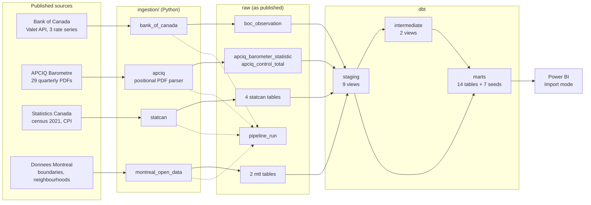
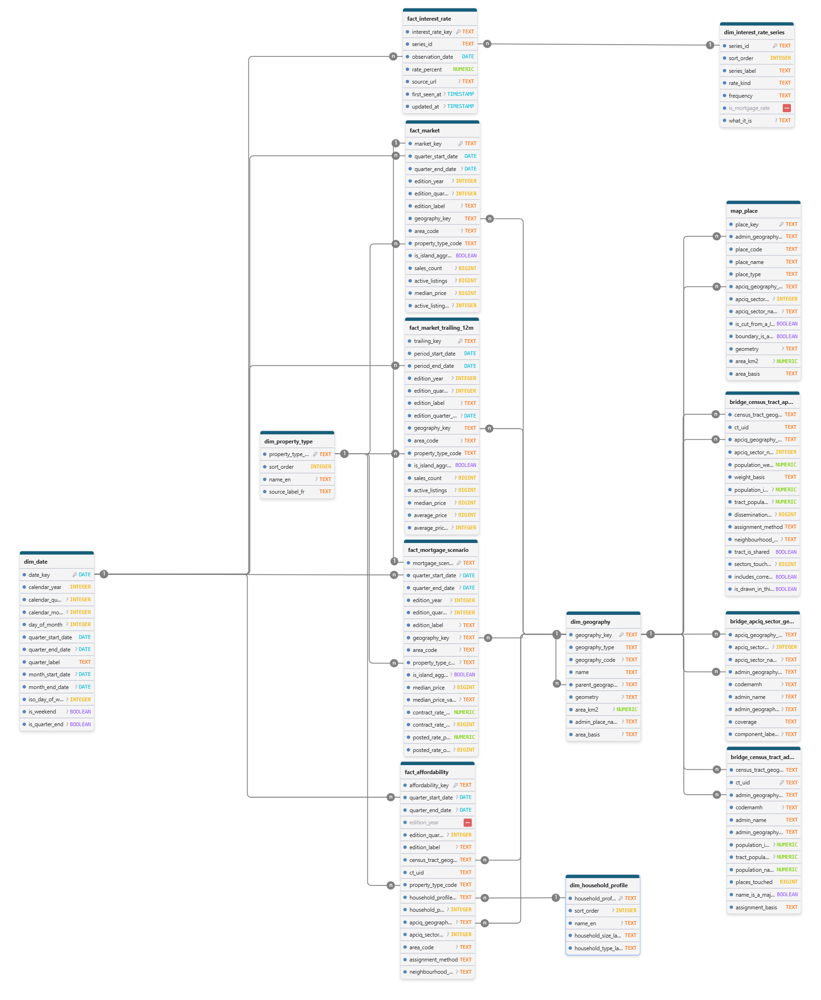

# Architecture

How the pieces fit: where each one runs, what it hands to the next, and what
stops a mistake from travelling down the chain.

This document owns the **shape** of the system. It links rather than repeats:

| Question | Document |
|---|---|
| How a figure is made, step by step | [`methodology.md`](methodology.md) |
| What a figure may not be made to say | [`limitations.md`](limitations.md) |
| How the scheduler reaches the pipeline | [`../n8n/README.md`](../n8n/README.md) |
| How the report connects, and its model | [`../powerbi/README.md`](../powerbi/README.md) |
| Every column of every mart | [`erd/mhi-marts.sql`](erd/mhi-marts.sql) |

Every count below was read from the live database on **2026-09-14**.

---

## 1. The data lineage



Each arrow is a **hand-off with a contract**, and the rest of this document is
about those contracts:

| Hand-off | Contract |
|---|---|
| source → `raw` | Store what was published, as published. No interpretation. |
| `raw` → `staging` | Types, units, symbols. A value that cannot be read becomes a failing test, not a zero. |
| `staging` → `marts` | Grain changes happen here, and only through a bridge table that names its rule. |
| `marts` → Power BI | The report reads marts only. Nothing reaches into `raw` or `staging`. |

---

## 2. Where each piece runs

```
   LAPTOP (Windows)                          VPS  (2 vCPU, 8 GB, no firewall)
   ────────────────                          ────────────────────────────────
                                             ┌─ n8n stack (production, not ours) ─┐
   VS Code, Git Bash                         │  Schedule trigger, Monday 10:00    │
   .venv  Python 3.14.6                      │  SSH node ──┐                      │
   dbt  (development builds)                 └─────────────┼──────────────────────┘
   Power BI Desktop                                        │ restricted key
        │                                                  ▼
        │  SSH tunnel                         vps-pipeline.sh  (6-word whitelist)
        │  127.0.0.1:15432 ──────────┐                     │ docker compose run
        │                            │                     ▼
        │                            │        ┌─ mhi-runner (on demand) ──────────┐
        │                            │        │  code mounted READ-ONLY           │
        │                            │        │  python -m ingestion...  dbt build│
        │                            │        └─────────────┬─────────────────────┘
        │                            │                      │ network mhi_default
        │                            ▼                      ▼
        │                     ┌─ mhi-postgres ────────────────────────────────────┐
        └────────────────────►│  PostgreSQL 17.5 + PostGIS 3.5                    │
                              │  published on 127.0.0.1:5432 of the server ONLY   │
                              └───────────────────────────────────────────────────┘
```

| Component | Runs on | Why there |
|---|---|---|
| PostgreSQL + PostGIS | VPS, container `mhi-postgres` | Must be up when the laptop is off. Dedicated container: the n8n database image has no PostGIS, and sharing a production database with a portfolio project exposes it to a modelling mistake |
| Scheduled ingestion + `dbt build` | VPS, container `mhi-runner` | Next to the database, on a schedule, without the laptop |
| Scheduler | VPS, the existing n8n | Already running. It triggers; it does not transform |
| Development, ad-hoc builds | Laptop, through the tunnel | Same code, same lock file, same database |
| Power BI | Laptop | Desktop only, Import mode — no gateway, no licence, no database exposed |

**One code base, two places, zero forks.** The code reads `MHI_DB_HOST` and
`MHI_DB_PORT`: on the laptop they default to the tunnel, inside the runner they
point at the `postgres` service. Nothing else differs.

---

## 3. Ingestion — one module per source, one job per file

| Module | Source and transport | Raw tables | Rows | Scheduled |
|---|---|---|---|---|
| `bank_of_canada` | Valet REST API, JSON | `boc_observation` | 4 241 | **yes** |
| `apciq` | 29 PDFs, positional parser | `apciq_barometer_statistic` · `apciq_control_total` | 24 795 · 1 363 | **yes** |
| `statcan` — CPI | Web Data Service, JSON | `statcan_cpi_observation` | 151 | **yes** |
| `statcan` — census | ZIP archives behind an HTML form | `statcan_income_statistic` · `statcan_geographic_attribute` · `statcan_census_tract_boundary` | 77 385 · 13 844 · 541 | frozen |
| `montreal_open_data` | CKAN API, GeoJSON | `mtl_administrative_boundary` · `mtl_neighbourhood` | 34 · 123 | frozen |

**Frozen is a measurement, not an omission.** The 2021 census and the city
boundaries will not change; re-running them downloads hundreds of megabytes to
insert zero rows. They remain one command away.

Every module splits the same way, so that each file can be tested without the
others:

| File | Knows about | Does not know about |
|---|---|---|
| `datasets.py` / `series.py` / `editions.py` | what to fetch: identifiers, URLs, licences | HTTP, the database |
| `valet.py` / `ckan.py` / `download.py` / `wds.py` | the network | the database |
| `parse.py` | bytes → records | the network, the database |
| `load.py` | the database | the network |
| `run.py` | the order of the above, and the run log | — |

That split is what lets **140 pytest tests** run the parsers against real,
reduced source files in `tests/fixtures/` with no network at all.

### Three rules every loader obeys

**Idempotence is declared in the database, not promised by the script.** Each
raw table has a primary key on the natural identity of an observation — for a
rate, `(series_id, observation_date)`. A buggy script *cannot* insert a
duplicate. The upsert rewrites a row only when its value changed, so
`updated_at` means "the source revised this", not "the pipeline ran".

**Values are stored as published.** Numbers land as text; APCIQ's `-`, `**` and
blank stay three different things; Statistics Canada's symbol column is kept
beside the value it qualifies. Casting at ingestion would either crash on an
unexpected format or produce a silent zero.

**Every run leaves a row.** `raw.pipeline_run` records `pipeline_name`,
`run_id`, `started_at`, `finished_at`, `rows_received`, `rows_inserted`,
`rows_updated`, `rows_loaded`, `status` and `error_message` — including for a
run that failed.

---

## 4. Schema changes

`sql/bootstrap/` holds ten numbered files, `00` to `09`, and serves two paths
with the same files:

| Situation | What applies them |
|---|---|
| A brand-new volume | Docker, at first start, in filename order |
| A database already running | `bash scripts/migrate.sh` |

`public.schema_migration` records each applied file with a **checksum**.
Editing a file that has already run is detected as drift: nothing is applied and
the script exits 1. Every statement is written `IF NOT EXISTS`, and a pytest
test requires it, so replaying a migration is always safe.

---

## 5. Transformation — dbt, four layers

| Layer | Schema | Materialised as | Count | Job |
|---|---|---|---|---|
| sources | `raw` | — | 10 declared | freshness, declared per table |
| staging | `staging` | views | 9 | one model per raw table: types, units, symbol handling, flags |
| intermediate | `staging` | views | 2 | logic with more than one reader downstream |
| marts | `marts` | tables | 14 + 7 seeds | the star schema the report reads |

**Why the two intermediate models live in the `staging` schema:** nothing outside
dbt reads them. A schema of their own would cost a migration for no reader.

### The marts

| Model | Rows | Grain | Role |
|---|---|---|---|
| `fact_market` | 1 653 | quarter × area × property type | what APCIQ published, five measures, each with its status |
| `fact_market_trailing_12m` | 1 653 | 12-month window × area × property type | kept apart: windows overlap by nine months and must never be summed |
| `fact_mortgage_scenario` | 1 653 | quarter × area × property type | everything that depends on the price only: down payment, premium, loan, payment |
| `fact_affordability` | 141 462 | quarter × census tract × property type × household profile | everything that depends on the household |
| `fact_interest_rate` | 4 241 | series × observation date | the three rate series, daily and weekly side by side |
| `dim_date` | 4 383 | day | daily because the Bank of Canada is daily |
| `dim_geography` | 595 | 1 island, 16 municipalities, 19 boroughs, 18 APCIQ sectors, 541 census tracts | one table, five `geography_type` values, polygons included |
| `dim_property_type` | 3 | | declared, then checked against the printed labels |
| `dim_household_profile` | 3 | | declared, then checked against the census labels |
| `dim_interest_rate_series` | 3 | | posted and contracted rates flagged, never both |
| `bridge_census_tract_apciq_sector` | 543 | tract × sector | 541 tracts, one genuinely shared, plus one zero-weight row that states a true geographic fact |
| `bridge_apciq_sector_geography` | 36 | sector × place | two boroughs split between two sectors each |
| `bridge_census_tract_admin_place` | 541 | tract → place | the name a map tooltip shows |
| `map_place` | 36 | shape | 32 whole places plus 4 halves, clipped to land |

The seeds are loaded into `marts` as well: the three sets of **published lending
rules**, each row carrying its `source_url` and `retrieved_on`, and four
declarations the tests read.

### Four modelling decisions that shape everything downstream

1. **Grains are bridged, never joined implicitly.** A price is published per
   sector, an income per tract. The bridge carries the sector price down to each
   tract and every row says so in `price_basis`. See `methodology.md` section 5.
2. **A mistake a slicer could make is made impossible, not detectable.** The
   12-month figures are a separate table; a monthly payment lives where it cannot
   be repeated three times per household profile. No dbt test reaches a Power BI
   report, so the model has to be shaped so the wrong sum cannot be written.
3. **The island row is kept, flagged, never recomputed.** APCIQ publishes it
   separately and it is not the sum of its sectors. `is_island_aggregate` stops a
   visual from adding it to its own parts.
4. **No regulatory constant is written in SQL.** Down-payment brackets, insurance
   premiums and underwriting parameters are seeds with their source on every row.
   The one knowing exception — the 80 % loan-to-value threshold — is listed as a
   debt in `limitations.md` section 21.

---

## 6. Integrity is tested, not constrained

The whole database carries **exactly one foreign key**:
`raw.boc_observation.run_id` → `raw.pipeline_run.run_id`. The marts carry none.

Referential integrity in the marts is asserted by dbt `relationships` tests at
every build instead. That is dbt's usual pattern, and it has one consequence
worth knowing: **a diagramming tool pointed at the database draws no lines at
all.**

So the diagram is generated, not drawn from memory. `scripts/generate_erd.py`
reads columns and types from `information_schema` and relationships from the dbt
YAML, and writes two DDL files:

| File | Tables | Primary keys | Relationships |
|---|---|---|---|
| [`erd/mhi-marts.sql`](erd/mhi-marts.sql) | 21 | 12 | 26 |
| [`erd/mhi-marts-star-keys-tested.sql`](erd/mhi-marts-star-keys-tested.sql) | 14 | 12 | 21 — only those a test asserts |

**Both files are replayed against the real server inside a rolled-back
transaction.** PostgreSQL refuses a foreign key whose target is not unique, so a
clean replay proves the keys are coherent — something no diagramming tool
checks. That replay caught a wrong key twice.



*The 14 tables of the star and the 21 relationships a dbt test asserts at every
build. Column lists are cut for legibility — `fact_affordability` alone has 47
columns — and every column is in [`erd/mhi-marts.sql`](erd/mhi-marts.sql).
`fact_mortgage_scenario` → `fact_market` is one-to-one: a mortgage scenario
extends a market row, it is not an independent fact.*

The picture is drawn from the second file in drawDB, by hand. When the picture
and the `.sql` disagree, the `.sql` is right.

---

## 7. Quality gates — five, at five different moments

| Gate | Runs | Catches |
|---|---|---|
| `pytest` — 140 tests | before a commit | parsers on real reduced source files; loaders on the **real tables inside a transaction that is always rolled back**; migrations that are not replayable |
| `dbt build` — 321 tests | every build, including the scheduled one | 288 generic tests plus **33 singular tests**, the ones that matter: every published cell reaches `fact_market` with its value and its status; the tracts carry every resident of the island; the sector polygons tile the island exactly |
| `scripts/report_oracle.py` | at report acceptance | computes from the marts what every card must display, so a visual with the right shape and the wrong number does not pass |
| `scripts/check-secrets.sh` — 8 sections | before every commit | `.env` values in any tracked file **and in the git history**, keys, public IP addresses, **APCIQ figures written directly or indirectly**, and files it cannot read — which it lists rather than skips |
| `scripts/check_powerbi_project.py` | before committing report definitions | a number shaped like a price inside a Power BI project file |

**Every gate has been fired on purpose.** A test that has never failed has not
shown it can. Each guard in this repository was given a positive control — a
corrupted value, a deleted polygon, a planted figure — and required to fail on
it. Twice, that exercise found a hole in the tests rather than in the data.

`bash scripts/prove-quality-gate.sh` replays the simplest one end to end:
corrupt a raw value, require `dbt test` to fail and name the test, repair by
re-running the pipeline, require the tests to pass again.

---

## 8. Orchestration

Every Monday at **10:00** (America/Toronto), n8n asks the server for `refresh`:
the Bank of Canada, the CPI and APCIQ, then **one** `dbt build`. One build after
all ingestion, never one per source, because the CPI restates APCIQ prices and a
new quarter built before its index would fail a test transiently.

Four things make it trustworthy, all detailed in
[`../n8n/README.md`](../n8n/README.md):

- **The verdict travels by exit code** — `0`, `64` refused, `69` locked, `70`
  failed — because n8n sits on another Docker network and cannot query the
  database.
- **A failure cannot look green.** n8n's SSH node returns a non-zero exit code
  as data, not as an error; a Code node turns it into one, which fires an error
  workflow that sends the alert.
- **The key n8n holds can do one thing.** A forced command in `authorized_keys`,
  a source-address restriction, and a whitelist that is matched, never
  evaluated.
- **What runs is a commit you can name.** Deployment ships `git archive HEAD`;
  a dirty tree is refused, and `.env`, being untracked, cannot be shipped.

The schedule was 06:00 until the first scheduled run, on 2026-09-14, failed on
it: Statistics Canada locks its tables from midnight to 8:30 Eastern and answers
HTTP 409 meanwhile. The other two sources of that same run succeeded, and the run
exited `70` as designed.

---

## 9. Consumption — Power BI

| Choice | Reason |
|---|---|
| **Import**, not DirectQuery | *Publish to web* refuses DirectQuery; Import needs no gateway and no exposed database. The analytical grain is the quarter |
| **Through the SSH tunnel** | the database listens on the server loopback only |
| **Marts only** | a report that reaches into `staging` documents an exception |
| `dim_geography` **split into two tables** at import | the market facts key on a sector, the affordability fact on a tract; one dimension covering both would filter one and silently not the other |
| **Shape files versioned** in `powerbi/shapes/` | 541 tracts, 18 sectors, 36 places — Statistics Canada and city open licences, so the maps can be redrawn after a clone |

The report has four pages: **Market** (the market by APCIQ sector),
**Affordability** (census tracts, on a map coloured by the income shortfall),
**First-time buyer** (a verdict per sector under an income and a down payment
the reader chooses) and **Macro** (the rate series). Its design and every DAX measure are in
[`../powerbi/report-design.md`](../powerbi/report-design.md).

**The report file is not in the repository.** It holds APCIQ figures in a
compressed model no scanner can inspect, and the APCIQ licence forbids
reproducing them. The only committed report file is the milestone J2 one, which
holds Bank of Canada rates only.

---

## 10. Security model

The server has **no firewall**. Everything below follows from taking that
seriously rather than fixing something else first.

| Risk | Control |
|---|---|
| The database is reachable from the internet | bound to `127.0.0.1` on the server; every client uses an SSH tunnel |
| The scheduler's key leaks | `command=` forces one script, `from=` accepts only the Docker subnet, `restrict` disables forwarding, and the script matches a six-word whitelist without ever evaluating the request |
| A pipeline starves the production n8n stack | memory ceilings (1 GB database, 2 GB runner), a non-blocking lock, one build per run |
| The pipeline alters its own code | the code is mounted read-only in the runner |
| A secret reaches git | `.env` is untracked; deployment ships a commit, not a folder; `check-secrets.sh` scans the files and the history, and ends with a positive control |
| A licence is breached | no APCIQ figure in any tracked file, enforced by section 6 of `check-secrets.sh`; report files ignored by default |
| A personal identifier is published | commits use a no-reply address; the alerting workflow, which holds a chat ID, is not versioned |

---

## 11. What is deliberately absent

The brief excludes Kafka, Spark, Kubernetes, Airflow, Snowflake, MongoDB,
Elasticsearch and MLflow unless a need is written down. None was.

The largest table has **141 462 rows**. A full `dbt build` takes **34 seconds**
on two shared virtual CPUs. A weekly schedule with one door and an exit code is
the whole orchestration problem, and a scheduler already running on the server
solves it. Adding a distributed engine or a second orchestrator would add a
second thing to maintain for one person, and no answer.

Two smaller absences are choices too. **No Docker socket is mounted into n8n**:
it would hand every workflow on that host the equivalent of root. **No
DirectQuery**: see section 9.

---

## 12. Reproducing it

The [README](../README.md) walks a fresh clone to a running database, a loaded
raw layer and a green `dbt build`, with nothing needed from the author.
